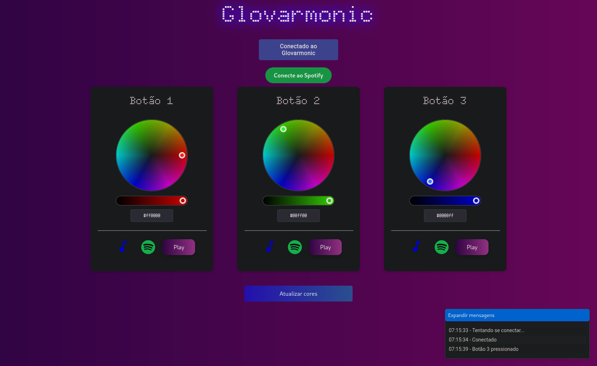

# **Glovarmonic**

The glovarmonic is an IoT wearable glove with buttons for user
interaction, an RGB LED for visual feedback, an HTTP server with a
control panel page, and a WebSockets server for message passing.

Terminology used here:

-   **The glovarmonic**: the hardware -- the device composed of the
    glove and components. Here it refers to the glovarmonic V1
    prototype.

-   **The program**: the software -- the code running inside the
    glovarmonic's ESP32.

# The hardware

## Glovarmonic V0: Development circuit

The glovarmonic V0 is the circuit used during the development of the
glovarmonic code. It is the most robust and reliable prototype ever made
and to ever be, and is flawless.

https://github.com/user-attachments/assets/f53730a1-ce2b-4adb-94f2-74ebad398d71

*Glovarmonic V0: circuit used during development.*

## Glovarmonic V1: Double glove

The glovarmonic V1 is all the components from V0, plus a battery, wires,
and two gloves. It's the first wearable prototype. Head to [Glovarmonic
V1 assembly](docs/glovarmonic-v1-assembly/doc.md) for details on the
assembly procedure.

https://github.com/user-attachments/assets/c52f716f-7a01-4f00-8368-00430fba7791

*Glovarmonic V1: covered view.*

https://github.com/user-attachments/assets/555f5fd9-0ba8-48a1-84cf-e4e8993f091b

*Glovarmonic V1: inside view.*

# The software

## Sequence diagram

Sequence diagram of a typical user interaction, showing all the features
of the glovarmonic and the program.

Participants:

-   Glovarmonic: the glove, running the program (as per the terminology)
-   User: the person wearing the glove
-   `/glovarmonic`: the glovarmonic control panel page, served by the
    HTTP server
-   `/ws`: the WebSockets server endpoint
-   `/connect_wifi`: the page used to connect the glovarmonic to a WiFi
    network, served by the HTTP server

The yellow strips are separators for common interactions.


## Execution flow

### WiFi

Upon boot, the program checks if it has WiFi credentials saved to the
filesystem (SSID and password). If the credentials are found, it tries
to connect to the station with the given SSID (station mode). The
onboard LED stays flickering while the program is waiting for
connection. If the connection is successful, the LED is turned off; if
not, the LED remains on, and the program starts the WiFi access point
(AP mode).

### Servers

The SSID for the WiFi AP is `GlovarmonicAP-{glovarmonic_id}`, where
`glovarmonic_id` is the hexadecimal number that identifies this
glovarmonic (see [Glovarmonic ID](#glovarmonic-id) for more details),
and the password is "12345678". Inside the AP network, the ESP32 is
acessible by the IP address `192.168.4.1`.

After the WiFi connection is made (in either station or AP mode), the
HTTP and WebSockets servers are started. The HTTP server exposes the
`/glovarmonic` and `/connect_wifi` URLs, and the WebSockets server
exposes the `/ws` URL.

#### `/glovarmonic`



*The `/glovarmonic` page.*

The `/glovarmonic` URL is the main page, the control panel of the
glovarmonic. It allows configuring actions when the glove buttons are
pressed through the three cards on the center, and monitoring WebSockets
events on the expandable window in the bottom-left corner.

On the top there is an element showing the status of the connection to
the glovarmonic, and a button to connect to Spotify's API.

The color pickers and the hexcolor inputs on the cards allow changing
the color that is set to the RGB LED when the respective button is
pressed. When the blue button on the bottom is pressed, the page sends
three `ws::messages::SetButtonRGB` messages (defined in
`include/ws.hpp`) to the WebSockets server, one for each button, to
update the configuration on the glovarmonic (see [WebSockets supported
messages](#websockets-supported-messages) for more details).

Below the color actions we have buttons to choose what audio is played
when a button is pressed (notified by the WebSockets server). It's
possible to choose either a local file to play, or a spotify track. Upon
clicking the Spotify icon a popup window is shown for searching Spotify
tracks.


*Spotify track search input.*


*Results of the Spotify search.*

#### `/connect_wifi`


*The `/connect_wifi` page.*

The `/connect_wifi` URL allows connecting the ESP32 to a network station
by passing the SSID and password of the network. When these credentials
are received via a POST form, they are saved to the filesystem, and the
ESP32 is restarted so the execution flow starts from zero.
Unfortunately, as HTTPs is not yet supported, these credentials are
transmitted in plain-text via WiFi, which can be a serious security
issue. An alternative is to supply these credentials at compile-time
through [Compile-time filesystem
generation](#compile-time-filesystem-generation).

#### `/ws`

The `/ws` URL exposes the WebSockets server. The messages flow both
ways: the server sends messages to all client when a button is pressed
on the glove, and a client can send messages to control the glove. In
particular, a client (e.g., using the page at `/glovarmonic`) can send a
message to change the color that is set to the RGB LED when a button is
pressed. See [WebSockets supported
messages](#websockets-supported-messages) for more details.

### Main loop

After the servers are running, the program enters the Arduino `loop()`
function. This is where the button states logic is handled, with support
for some [button gestures](#button-gestures), and occasionally the
WebSockets client cleanup is run.

## Glovarmonic ID

The glovarmonic ID is the hexadecimal number that identifices each
glovarmonic device. It is used for the SSID of the glovarmonic AP when
in AP mode (e.g., `GlovarmonicAP-F9D108`), and for the mDNS name when in
station mode (e.g., `glovarmonic-f9d108.local`). It was designed to
disambiguate between multiple glovarmonics in the same location, while
still being rememberable.

This number is obtained from the lower 3 bytes of the ESP32's fused MAC
address, in little endian order. For example, the MAC address of the
ESP32 used in the assembly of the glovarmonic V1 prototype is
`08:d1:f9:eb:1d:bc`, and its glovarmonic ID is `f9d108`.

## Compile-time filesystem generation

The `platformio.ini` configuration file includes an `extra_scripts`
directive with `scripts/prepare_data.py`. This script defines a single
function, `before_littlefs`, that prepares the content under `data/`
(which is used to build the filesystem image) by copying the content
under `assets/` to the same subpath under `data/`, performing additional
processing for certain files:

-   For HTML files:
    -   Substitutes the string `{{ glovarmonic_id }}` by the glovarmonic
        ID of the ESP32 being uploaded to;
    -   Minifies the HTML, CSS and Javascript content
    -   Compresses using gzip
-   For Javascript files:
    -   Compresses using gzip

Other files are copied as-is to `data/`.

This setup can be used to save WiFi station credentials at compile-time
to the filesystem, by creating the files `assets/wifi_ssid` and
`assets/wifi_psk`. These files are ignored by git, so they won't end up
in the commit history.

## Button gestures

The glovarmonic supports button gestures, which can be activated by
holding two or more buttons pressed together for 3 seconds.

-   Index button + middle button + ring button: if the three buttons are
    pressed together for more than 3 seconds, the program removes the
    saved WiFi credentials (if any) and restarts.
-   Index button + ring button: turns off the RGB LED.
-   Middle button + ring button: enters deep sleep mode.

To support these button gestures, individual buttons are activated on
button release instead of press.

## WebSockets supported messages

The messages that the WebSockets understands are defined in
`include/ws.hpp`, under the namespace `ws::messages`. Each message is
prefixed by a 1-byte header that specifies the type of message, followed
by a variable-sized payload specific to the type of message.

Messages can be sent on the command line easily by using `websocat`. For
example, to send a `SetRGB` message to the WebSockets server running at
`192.168.4.1/ws` (in AP mode):

``` sh
printf '\x00\x30\x00\xff' | websocat -b - ws://192.168.4.1/ws
```

In this example, the header is `0x00`, `r` is `0x30`, `g` is `0x00` and
`b` is `0xff`.

### `SetRGB`

Header: 0

``` cpp
struct Payload {
    uint8_t r;
    uint8_t g;
    uint8_t b;
}
```

Directly set the RGB LED color to the `r`, `g` and `b` bytes.

### `SetButtonRGB`

Header: 1

``` cpp
struct Payload {
    uint8_t button;
    uint8_t r;
    uint8_t g;
    uint8_t b;
}
```

Set the color that is set to the RGB LED when the button number `button`
is pressed, where `button` should be either 1, 2 or 3.

# Credits

The authors:

-   [@aryaalcantara](https://github.com/aryaalcantara)
-   Giovana
-   [@joaopspsps](https://github.com/joaopspsps)
