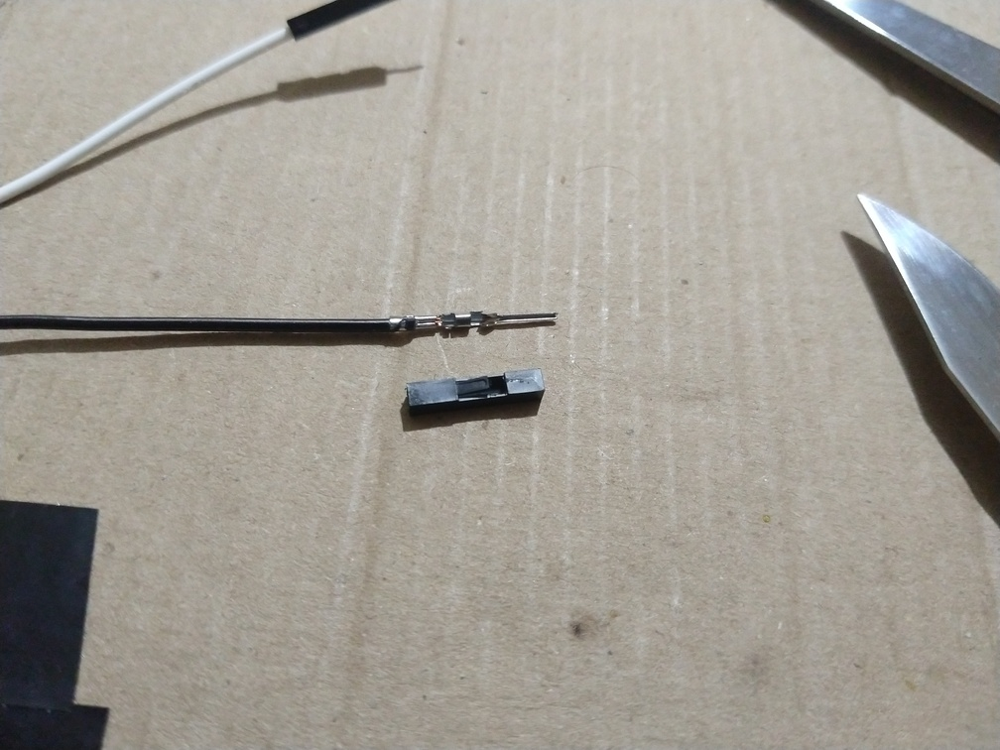
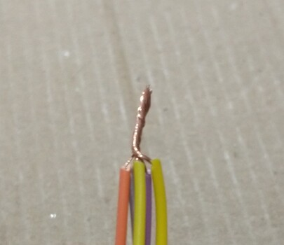

# **Glovarmonic V1 assembly**

# Components

We want a glove with three buttons on the index, middle and ring
fingers; an RGB LED somewhere; a way to power the circuit without a USB
cable connected to a computer; and, of course, wires.

To hide the components we'll actually use two gloves. We'll mount the
components on the first one, and wear the second one over it. That
should hide the implementation details, literally.

## Glove

We'll use a pair of long black nylon gloves. Long-sleeved to have extra
space for the components, and made of nylon to be easy to hand sew into.

## Buttons

We're just going to use standard push buttons, the ones that need
`INPUT_PULLUP` and have four legs. They're probably not the best choice
for this, maybe a bit fragile, but should be enough.

*Push buttons we'll be using.*

## RGB LED

We'll use an RGB LED module, with pins for each R, G and B color
component and another for GND (common cathode). The pins will be removed
and replaced with soldered wires.

*RGB LED we'll be using (I forgot to take pictures before assembling the
circuit).*

## Wires

We'll salvage and use jump wires to connect the components, because they
already have handy connectors and are easy to splice together due to
stranded copper inside. We didn't have female-to-female jump wires, but
it's easy to ~~castrate~~ remove the pins from the male connectors to
turn them into females.

*Jump wires we'll be using to connect the components.*

## Battery

After some research we arrived at three main options, ordered by
descending simplicity/convenience ot use:

1.  USB Powerbank
2.  Li-Ion / LiPo battery + ESP board with built-in battery connector.
3.  Li-Ion / LiPo battery connected to 5V and GND directly.

The first option is the easiest one: just plug it to the ESP board and
be done with it. However there are some downsides: (1) the powerbank can
be quite big and obstrusive; (2) powerbanks usually automatically switch
off after some time; (3) it's boring. This third downside is the most
critical.

The second option is a trade-off between simplicity and reliability. We
would need to buy a specialized board with a built-in battery connector
to plug the battery to, and of course a battery too.

For the third option we would only need to buy a battery and connect it
to the 5V and GND pins on the board. However, after some research, this
seems to be a bit too "low-level" for us. Using the battery this way, if
there are no extra battery protection circuitry on the board, plugging
the battery and USB at the same time could damage the components (even
the USB). We also can't recharge the battery.[^1]

So we settled for the second option. We chose to use a flat LiPo battery
because it's relatively small and can be more easily hidden between the
two gloves.

*LiPo battery (3.7V 450mAh) we'll be using.*

## ESP board

We'll use the Wemos Lolin32 Lite board as it's got a handy JST PH
battery connector onboard, directly compatible to the LiPo battery we
bought. It was also on discount (and it's probably not original).

*Wemos Lolin32 Lite board we'll be using.*

# Summary of prices

  Item                              Amount        Price
  ------------------------------- -------- ------------
  Wemos Lolin32 Lite board               1    R\$ 36,95
  LiPo battery 450mAh                    1    R\$ 30,88
  RGB LED module                         1   R\$ \~1,80
  Push buttons                           3     R\$ 0.54
  Jump wires (female-to-female)         40   R\$ \~9,40
  Soldering kit                          1    R\$ 73,79
  Sewing thread                          1   R\$ \~1,50
  Gloves                                 4    R\$ 60,00

Total price: R\$ 214.86

Notes:

-   The items are based on what was actually to assemble the glove, but
    it's a good idea to get some spare items if possible.
-   Prices are in [Brazilian
    reais](https://en.wikipedia.org/wiki/Brazilian_real).
-   The price column is already calculated with respect for the amount.
-   Prices prefixed with "\~" are estimated because the item was not
    bought directly or we already had it.
-   This doesn't account for other common tools, such as pliers,
    scissors, etc.

# Assembly schematic

*Glovarmonic V1 assembly schematic.*

1.  The buttons will be placed on the fingertips, kept in place by
    sticking the legs into the fabric and making two hooks, and
    solredered to the jump wires soldered to the legs (more details on
    that later).
2.  The RGB LED is at the back of the palm, closer to the first knuckle,
    sewn to the glove through its mounting holes.
3.  There's some free space where the wrist bends so the components
    don't block movement.
4.  The GND wires for the buttons and the RGB LED will be spliced
    together so they can all be connected to the ESP's GND.
5.  The ESP32 is next to the battery, sewn to the glove through its
    mounting holes.
6.  The battery will be kept inside a cute little pocket sewn into the
    glove, along with a kind of strap in front of the pocket opening so
    it doesn't fall off.

# ESP32 Pinout

-   Pin 12 ⇄ Index finger button
-   Pin 14 ⇄ Middle finger button
-   Pin 27 ⇄ Ring finger button
-   Pin 26 ⇄ RGB LED "R"
-   Pin 25 ⇄ RGB LED "G"
-   Pin 33 ⇄ RGB LED "B"
-   Pin GND ⇄ GND wires spliced together

The 12, 14 and 27 pins can be connected to either the left or right legs
of the buttons; the other leg will be connected to GND.

# Procedures

Suggested order:

1.  Solder header pins to the ESP32 board (if not already)
2.  Sew components into their right place.
3.  Sew the battery pocket
4.  Attach buttons to the fingertips
5.  Splice GND wires together
6.  Connect wires to the board
7.  Test
8.  Cable management
9.  Cover it with another glove

## Sewing components

Use a needle and thread to sew the components into the glove through the
mounting holes. The ESP32 board is placed on the back of the hand, near
where the wrist bends, and the RGB LED is placed near the knuckles so it
doesn't fight for space with the board pins.

It's useful to position the components while you're wearing the glove,
and hold them in place by using tape for example, for later sewing. Or,
simply have more than two hands.

Be careful not to accidentally bite the needle into the opposite end of
the glove while you're sewing, otherwise you won't be able to put on the
glove. If that happens, undo the thread and try again.

*RGB LED sewn into the glove through its mounting holes.*

*ESP32 sewn into the glove through its mounting holes.*

## Battery pocket

Put your best sewing skills to use for this one. Position the battery on
the forearm, near where the wrist bends, not too far from where the
ESP32 board is. Grab a piece of fabric from a similar material or a
spare identical glove and cut it to the measures of the battery. There's
no need to make the space inside the pocket too snug, as we'll also add
a strip over the pocket entrance to prevent the battery from falling
off. Sew the strip across the pocket entrance, one end above the pocket,
and another above the glove. Leave some slack so you can insert/remove
the battery, but also not *too* loose.

It helps to fold the sleeve of the glove close to where you're sewing so
you can access the inside of the glove more easily.

*Battery pocket. I used a backstitch for this. I followed the
instructions on this video, with no previous sewing experience:
<https://www.youtube.com/watch?v=ZvzMMcKHVR4>. Of course, it helps to
practice a bit on a test fabric first before moving to the real thing.*

## Jumper wires preparation (optional)

If you don't have female-to-female jump wires, you can remove the pins
on male connectors to turn them into female connectors.

*Use a knife to raise the "lock" on the protector.*

*Once it's raised, the protector can be easily pulled off the cable.*

*Use pliers to wiggle the pin and break it out of the cable.*

*After removing the pin, you'll have some free space to insert external
pins. For some jump wires this space can be very tight, or the head of
the connector can get bent after wiggling, which prevents external pin
insertion. To fix this use pliers to widen the gap in the connector, or
bend the head of the connector back to normal.*

After that, put the protector back and push the lock back in place.

## Push buttons preparation

*Use pliers to flatten the legs of the buttons.*

*After removing the protectors from the jump wires, attach them to the
push button legs. Solder them together.*

*Use heat shrink tubing or electrical tape to protect the connections.*

*Stick the other legs of the button into the glove, and bend them into
hooks to fix the button in place.*

*Once the this procedure has been applied to all buttons, bring the
wires behind the fingers, onto the back of the hand.*

## Splicing GND wires together

For this we'll need actually 5 wires: 3 for each button, 1 for the RGB
LED, and another to be connected to the board's GND pin.

*Strip the ends of the wires to expose the copper strands.*

*Gather the wires together facing the same direction. Four wires from
the components (buttons + RGB LED), another wire for the board's GND
pin.*

*Twist them together.*

*Maybe bend it too.*

*Use heat shrink tubinng (or electrical tape) to protect the exposed
copper strands.*

*The final result after shrinking the tubing.*

## Cable management

Once all wires have been connected between the components, the code has
been flashed to the chip and confirmed to be working as expected, it's a
good idea to do some cable management. We used electrical tape to join
related wires together, and added some loops to keep the wires closer to
the glove. Admittedly, this could be more tidy.

*Cable management.*

## Cover it with another glove

Wear the glove you just made, and wear another glove over it. It helps
to roll the sleeves of the outer glove up to the fingers, so you don't
have to squeeze through inside the glove, potentially damaging
components or scratching the glove. After the fingers are inserted,
*un*wear the inner glove and unroll the sleeve of the outer glove more
easily now.

[^1]: There are components that can be used to charge a battery without
    an ESP board, such as a TP4056 battery charger module. We could
    solder some wires around and use the module's USB connector to
    charge the battery, but there are still no protections against
    simultaneous battery and ESP board USB powering. We could use some
    [Schottky diodes](https://en.wikipedia.org/wiki/Schottky_diode) for
    that, but that seems a bit too much for this prototype. Also,
    depending on the battery, you have to make a surgery on the TP4056
    and replace a very tiny resistor labeled R3 so your battery doesn't
    get overcharged. I do not have the skill for this yet, nor the time.
